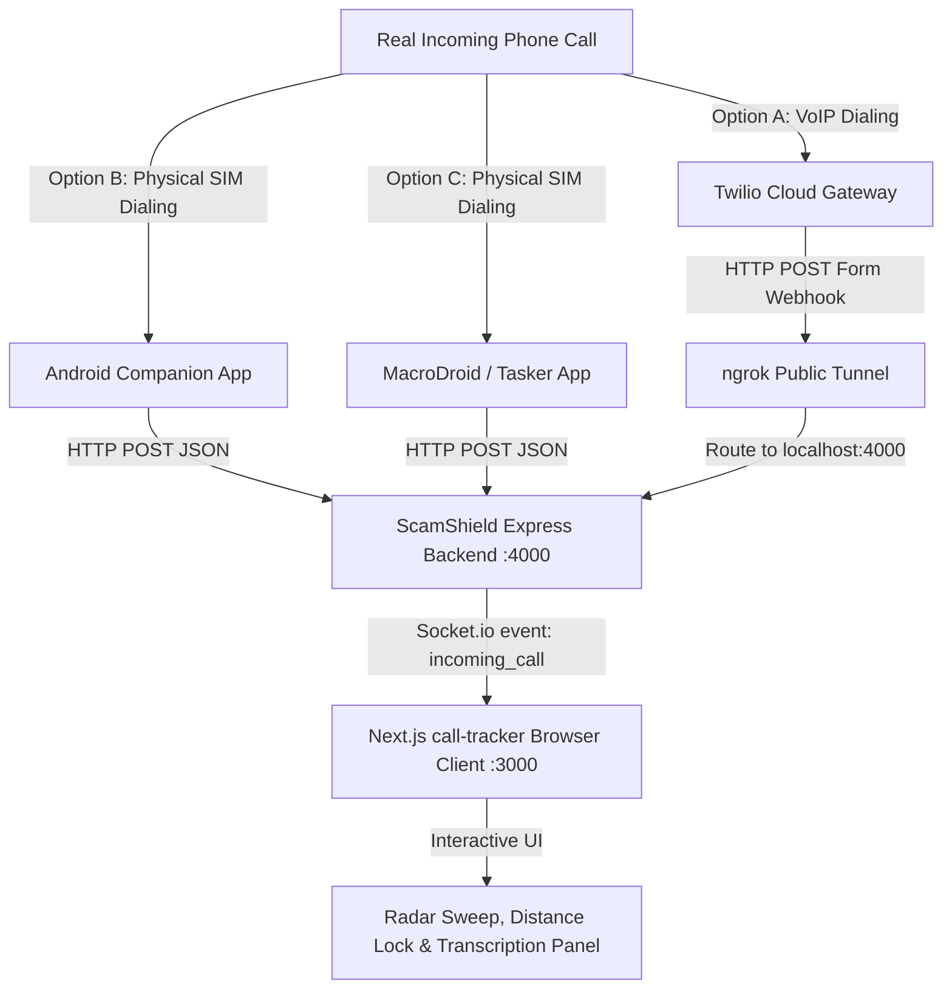

# Real-Time Phone Call Integration Guide

This guide details three production-grade workflows for routing live, incoming GSM or VoIP calls from physical devices/gateways directly into the **ScamShield Cambodia Call Tracker** browser interface (`http://localhost:3000/call-tracker`).

The backend handles these calls through two key endpoints:
1. **`POST /api/calls/detect`** (JSON payload - ideal for Android / custom apps / automation)
2. **`POST /api/calls/twilio`** (urlencoded form payload - ideal for direct Twilio phone number bindings)

Both endpoints push live data over the WebSockets connection in real-time.

---

## Architecture Overview



---

## Method A: Cloud Gateway Binding (Twilio Webhook)

This is the cleanest approach for cloud telephone lines. If an incoming caller dials your virtual phone number, Twilio runs a Webhook that automatically broadcasts the call data to your ScamShield dashboard.

### 1. Expose your Local Server
Since Twilio is in the cloud, it needs to hit a public URL. Expose your local backend using **ngrok**:
```bash
ngrok http 4000
```
This yields a public address similar to:
`https://a1b2-c3d4.ngrok-free.app`

### 2. Configure Twilio Phone Number
1. Log in to your [Twilio Console](https://console.twilio.com/).
2. Navigate to **Phone Numbers** > **Active Numbers** and click on your target number.
3. Scroll down to the **Voice & Fax** configuration block.
4. Under **A CALL COMES IN**, select **Webhook**.
5. Paste your exposed ngrok route URL:
   `https://a1b2-c3d4.ngrok-free.app/api/calls/twilio`
6. Set the HTTP method to **HTTP POST**.
7. Click **Save**.

### 3. TwiML Automation Responses
The ScamShield backend responds to Twilio with **TwiML XML**.
* **Unreported / Safe Numbers**: The system dials through normally and says:
  > *"ScamShield verified. Incoming connection is secure."*
* **High-Risk Numbers (Risk Score ≥ 75%)**: The system terminates/rejects the call and announces:
  > *"Warning! ScamShield has identified this incoming number as high risk. Please hang up immediately."*

---

## Method B: Physical Phone Integration (Android Companion Service)

For real-world physical phone numbers, you can compile a lightweight Android background service that monitors the phone's hardware state and sends network alerts to ScamShield.

### 1. Request Manifest Permissions
Ensure your app requests the necessary permissions to intercept calls and make web requests inside `AndroidManifest.xml`:

```xml
<manifest xmlns:android="http://schemas.android.com/apk/res/android"
    package="com.scamshield.companion">

    <!-- Permissions required for phone intercept -->
    <uses-permission android:name="android.permission.READ_PHONE_STATE" />
    <uses-permission android:name="android.permission.INTERNET" />

    <application>
        <!-- Register Broadcast Receiver for Phone State Events -->
        <receiver android:name=".PhoneCallReceiver" android:exported="true">
            <intent-filter>
                <action android:name="android.intent.action.PHONE_STATE" />
            </intent-filter>
        </receiver>
    </application>
</manifest>
```

### 2. Implementation: `PhoneCallReceiver.kt`
This receiver listens for phone state shifts. When the phone goes into a `RINGING` state, it fires an asynchronous HTTP request to the ScamShield API.

```kotlin
package com.scamshield.companion

import android.content.BroadcastReceiver
import android.content.Context
import android.content.Intent
import android.telephony.TelephonyManager
import android.util.Log
import okhttp3.*
import okhttp3.MediaType.Companion.toMediaType
import okhttp3.RequestBody.Companion.toRequestBody
import org.json.JSONObject
import java.io.IOException

class PhoneCallReceiver : BroadcastReceiver() {

    private val client = OkHttpClient()
    private val serverUrl = "http://YOUR_LOCAL_IP_ADDRESS:4000/api/calls/detect"

    override fun onReceive(context: Context, intent: Intent) {
        val state = intent.getStringExtra(TelephonyManager.EXTRA_STATE)
        
        if (state == TelephonyManager.EXTRA_STATE_RINGING) {
            val incomingNumber = intent.getStringExtra(TelephonyManager.EXTRA_INCOMING_NUMBER)
            if (!incomingNumber.isNullOrEmpty()) {
                Log.d("ScamShield", "Incoming call intercepted: $incomingNumber")
                postCallEvent(incomingNumber)
            }
        }
    }

    private fun postCallEvent(number: String) {
        val json = JSONObject().apply {
            put("number", number)
        }
        
        val mediaType = "application/json; charset=utf-8".toMediaType()
        val body = json.toString().toRequestBody(mediaType)
        
        val request = Request.Builder()
            .url(serverUrl)
            .post(body)
            .build()

        client.newCall(request).enqueue(object : Callback {
            override fun onFailure(call: Call, e: IOException) {
                Log.e("ScamShield", "Failed to forward call payload: ${e.message}")
            }

            override fun onResponse(call: Call, response: Response) {
                if (response.isSuccessful) {
                    Log.d("ScamShield", "Call details synchronized with local ScamShield service.")
                } else {
                    Log.e("ScamShield", "Server returned error: ${response.code}")
                }
                response.close()
            }
        })
    }
}
```

---

## Method C: No-Code Mobile Interceptor (MacroDroid / Tasker)

If you don't want to build or compile an Android application, you can use automation tools like **MacroDroid** or **Tasker** to set up the bridge in less than 3 minutes.

### 1. MacroDroid Configuration Step-by-Step
1. Install **MacroDroid** from the Google Play Store.
2. Click **Add Macro**.
3. **Trigger (+)**:
   * Select **Call/SMS** > **Call Incoming**.
   * Choose **Any Number**.
4. **Action (+)**:
   * Select **Connectivity** > **HTTP GET/POST** (or HTTP Request).
   * **Method**: `POST`
   * **URL**: `http://YOUR_LOCAL_IP_ADDRESS:4000/api/calls/detect` (Replace `YOUR_LOCAL_IP_ADDRESS` with your computer's local Wi-Fi IP address, e.g., `192.168.1.15`).
   * **Content Type**: `application/json`
   * **Request Body**:
     ```json
     {"number": "{call_number}"}
     ```
5. **Save** the Macro as `"ScamShield Call Forwarder"`.
6. Call your mobile phone from another number to verify the event immediately rings the browser tracker dashboard.

---

## Method D: Quick Tester (CLI Mock Dialer)

To test the integration end-to-end without having to physically dial a number, run this simple command in your terminal. It mimics a phone gateway and targets the backend immediately:

```bash
curl -X POST -H "Content-Type: application/json" \
  -d '{"number": "0969551630"}' \
  http://localhost:4000/api/calls/detect
```

If you have the **Call Tracker** page open at `http://localhost:3000/call-tracker`, you will instantly see:
1. The dashboard entering the **Ringing** stage.
2. The phone number `0969551630` being highlighted.
3. The location lock-on locking onto coordinates.
4. Live transcripts streaming in bilingual text formats.
