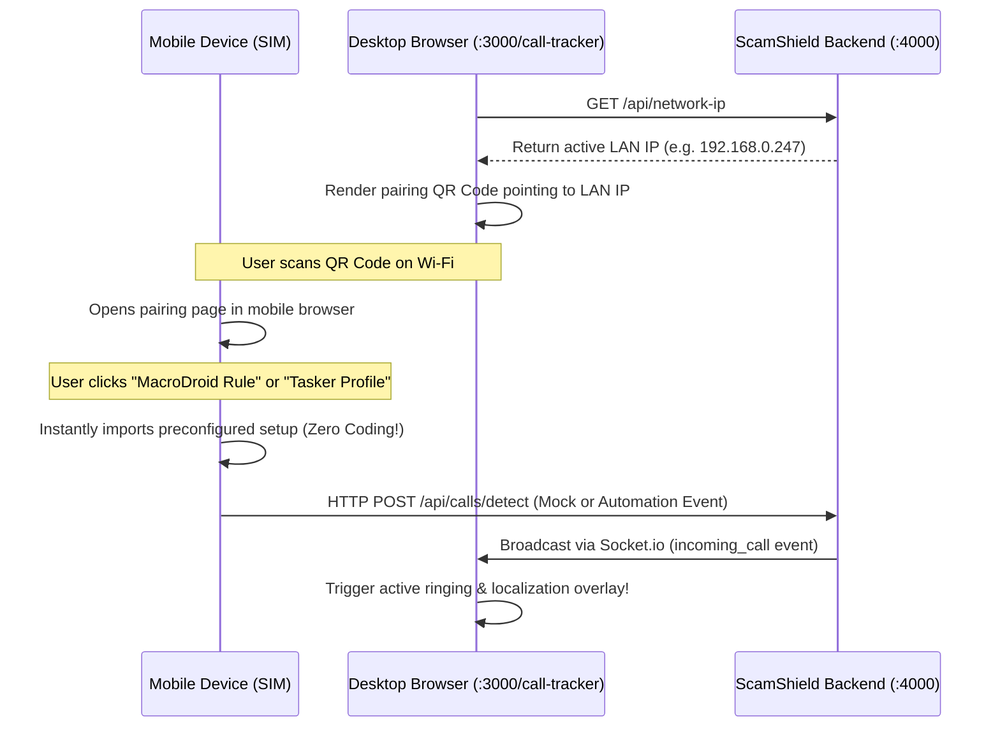

# Visual Refinements & QR Mobile Interception Walkthrough

This document highlights the visual polish applied to the search console interfaces, the dynamic LAN IP pairing service, and the click-to-download automation setup.

---

## 1. Search UI Refinements
The double-layered border-within-card look has been replaced by a modern, unified glassmorphism capsule across key page scopes:
* **Landing Page (`/`)**: Refined the container at [page.tsx](file:///Users/thoeurnratha/Desktop/ScamShield/frontend/src/app/page.tsx#L106-L127). The entire frame now scales background opacity and grows a vibrant red/orange shadow ring on focus.
* **Results Page (`/search`)**: Updated the search form at [search/page.tsx](file:///Users/thoeurnratha/Desktop/ScamShield/frontend/src/app/search/page.tsx#L106-L124) with scaled boundaries, matching the landing page design language.
* **Animations**: Embedded a micro-interaction into the submission button that slides the chevron icon slightly to the right (`group-hover/btn:translate-x-0.5`) and scales the button active state.

---

## 2. Phone Intercept via QR Codes
To let users connect real phones with the browser, we added a live LAN IP pairing service:



### Components Built:
1. **LAN IP Discovery Endpoint**: Added `/api/network-ip` mapping `getLocalIp` in [number.controller.ts](file:///Users/thoeurnratha/Desktop/ScamShield/backend/src/controllers/number.controller.ts) using the native `os` module.
2. **Mobile Pairing Control Page**: Created a responsive mobile dashboard at [pair/page.tsx](file:///Users/thoeurnratha/Desktop/ScamShield/frontend/src/app/call-tracker/pair/page.tsx) containing:
   - Copyable Webhook configuration address.
   - **Download MacroDroid JSON Rule**: Automatic JSON file exporter containing the dynamically resolved computer IP.
   - **Download Tasker XML Profile**: Automatic XML configuration exporter formatted for standard Tasker import.
   - **Phone Signal Simulator form**: For testing overlay connections.
3. **Dynamic QR Code Widget**: Added a sidebar pairing card inside [page.tsx](file:///Users/thoeurnratha/Desktop/ScamShield/frontend/src/app/call-tracker/page.tsx#L744-L772) fetching the local machine IP on mount and generating the code.

---

## 3. Verification & Validation Logs

### Backend Compilation Check
```bash
npx tsc --noEmit
# Status: Completed successfully with 0 errors
```

### Frontend Compilation Check
```bash
npx tsc --noEmit
# Status: Completed successfully with 0 errors
```

### Dynamic LAN Discovery Validation
```bash
curl -s http://localhost:4000/api/network-ip
# Output: {"ip":"192.168.0.247"}
```

---

## 4. Mobile Menu & Hydration Fixes

We resolved the mobile hamburger menu toggle bugs and JavaScript initialization issues:
* **Anti-Pattern Refactoring in [Navbar.tsx](file:///Users/thoeurnratha/Desktop/ScamShield/frontend/src/components/Navbar.tsx)**: Re-styled and converted nested component declarations (`LanguageSwitcher`, `ProfileDropdown`) into inline JSX functions to prevent React from recreating components and resetting state/event listeners on each render.
* **Corrupted Session Safeguard in [AuthContext.tsx](file:///Users/thoeurnratha/Desktop/ScamShield/frontend/src/context/AuthContext.tsx)**: Wrapped the initial token parsing from `localStorage` in a `try-catch` block to prevent invalid/malformed session tokens from throwing uncaught runtime exceptions.
* **Hydration Safeguard in [pair/page.tsx](file:///Users/thoeurnratha/Desktop/ScamShield/frontend/src/app/call-tracker/pair/page.tsx)**: Implemented a client-side `mounted` check to defer dynamic network-IP hostname resolutions until after client-side hydration, preventing Next.js mismatch warnings and ensuring event bindings remain interactive.
